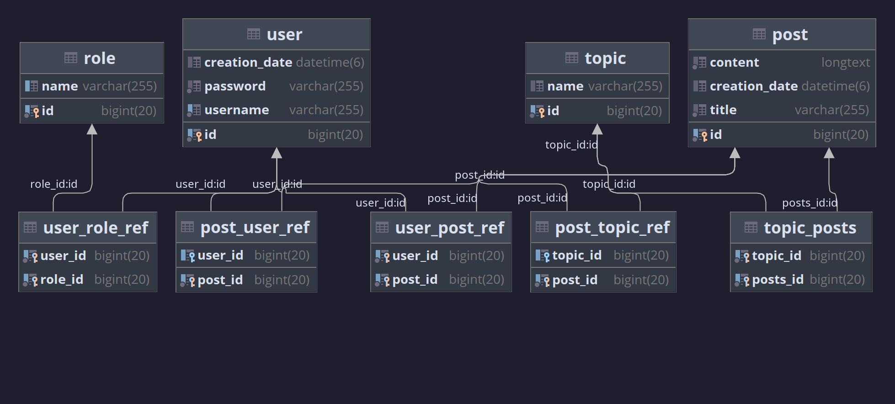

# mattslist

☮️ A classified ad service where users can view topics and create listings.

## Purpose

This application exhibits CRUD operations, as well as utilizing Thymeleaf to connect the database portion of the project to the backend.

## Technologies

Spring Boot 3.0.0 (M5)

### Spring Boot Dependencies
- Spring Boot DevTools
- Lombok
- Spring Web
- MariaDB Driver
- Spring Security
- JDBC API
- H2 Database
- Thymeleaf
- Spring Data JPA

## Diagram

