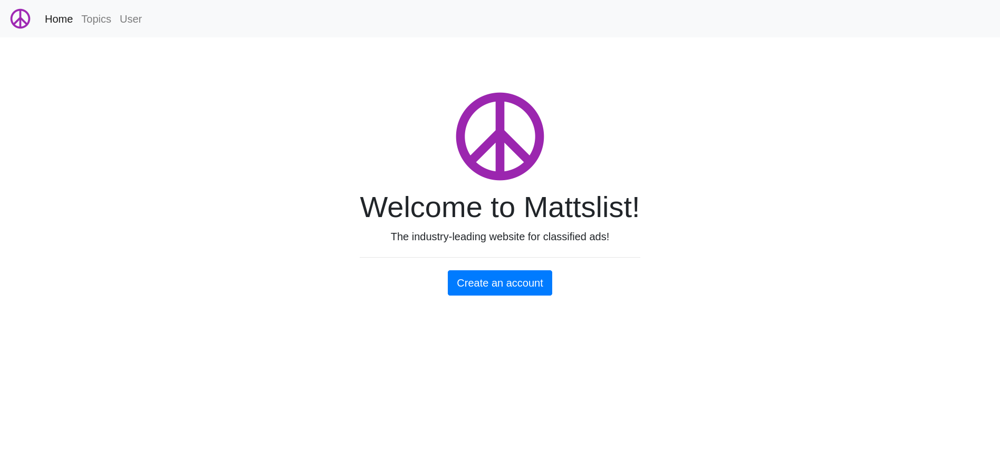

# mattslist

☮️ A classified ad service where users can view topics and create listings.



## Purpose

This application exhibits CRUD operations, as well as utilizing Thymeleaf to connect the database portion of the project to the backend.

## Technologies

Spring Boot 3.0.0 (M5)

### Spring Boot Dependencies
- Spring Boot DevTools
- Lombok
- Spring Web
- MariaDB Driver
- Spring Security
- JDBC API
- H2 Database
- Thymeleaf
- Spring Data JPA

## Diagram

```mermaid
classDiagram
direction BT
class post {
   longtext content
   datetime(6) creation_date
   varchar(255) title
   bigint(20) id
}
class post_topic_ref {
   bigint(20) topic_id
   bigint(20) post_id
}
class post_user_ref {
   bigint(20) user_id
   bigint(20) post_id
}
class role {
   varchar(255) name
   bigint(20) id
}
class topic {
   varchar(255) name
   bigint(20) id
}
class topic_posts {
   bigint(20) topic_id
   bigint(20) posts_id
}
class user {
   datetime(6) creation_date
   varchar(255) password
   varchar(255) username
   bigint(20) id
}
class user_post_ref {
   bigint(20) user_id
   bigint(20) post_id
}
class user_role_ref {
   bigint(20) user_id
   bigint(20) role_id
}

post_topic_ref  -->  post : post_id:id
post_topic_ref  -->  topic : topic_id:id
post_user_ref  -->  post : post_id:id
post_user_ref  -->  user : user_id:id
topic_posts  -->  post : posts_id:id
topic_posts  -->  topic : topic_id:id
user_post_ref  -->  post : post_id:id
user_post_ref  -->  user : user_id:id
user_role_ref  -->  role : role_id:id
user_role_ref  -->  user : user_id:id
```